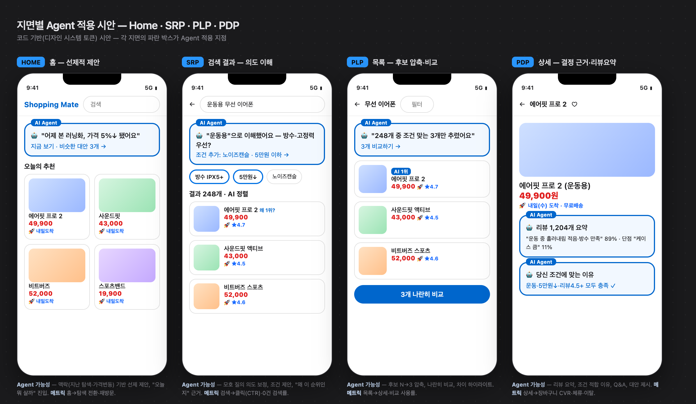
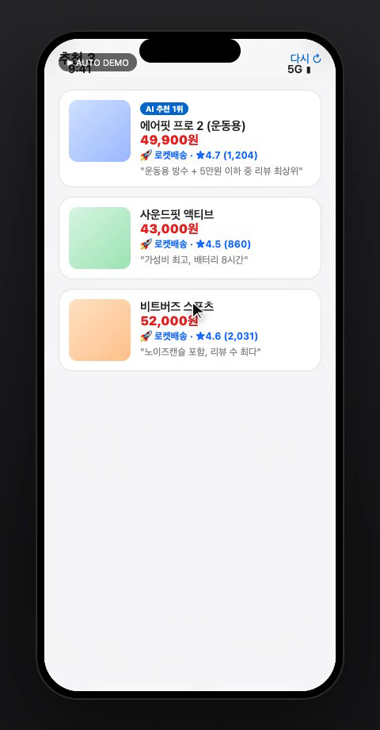
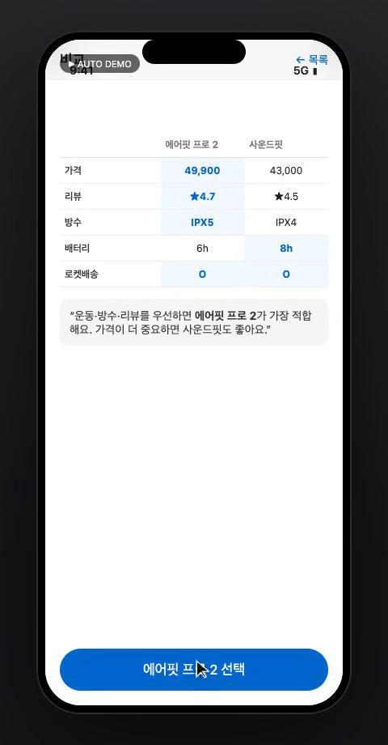
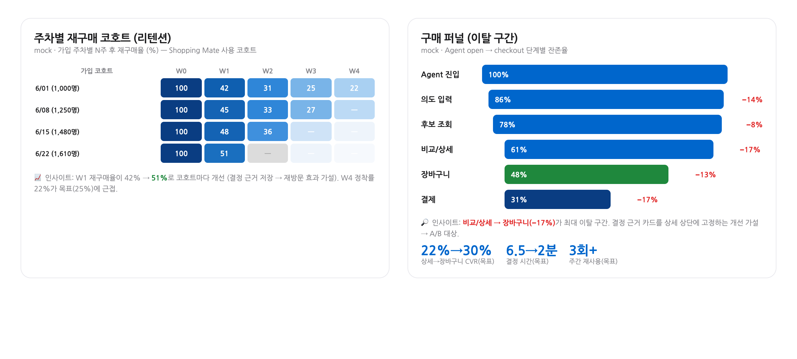

# Shopping Mate PRD (데모 — 쿠팡 Shopping Agent)

> Status: Draft
> Document Type: PRD
> Product: Shopping Mate (독립 신규 AI Shopping Agent 앱, 강의용 가정 사례)
> Last Updated: 2026-06-26
> Last Author: PM 차성재 with Claude Opus 4.8
> Owner: PM 차성재

Change Log

| 날짜 | 작성자 | 변경 내용 |
|------|--------|----------|
| 2026-06-26 | PM 차성재 with Claude Opus 4.8 | 플레이북 적용 — BLUF(두괄식) 결론 블록, §4A 지면별 Agent 매트릭스, §8A 코드 기반 시안·데모영상 임베드, Confluence storage format 참조 |
| 2026-06-26 | PM 차성재 with Claude Opus 4.8 | 초안 — 실무 AI 적용 사례 강의용 데모 PRD (커머스 Agent 관점) |

> **강의용 가정 사례 고지**: 본 문서는 FastCampus "실무 AI 적용 사례" 특강 데모를 위한 **가상 PRD**다. 쿠팡은 맥락 예시이며 실제 쿠팡의 계획·데이터와 무관하다. 수치는 mock(가짜) 데이터다.
>
> **작성 기준**: [PRD 작성 플레이북](../../../docs/guides/prd-authoring-playbook.md) (두괄식·중복제거·표 양식·지면별 Agent 매트릭스·코드 기반 시안/영상 임베드·Confluence storage format) 적용.

---

## 결론부터 (BLUF)

> **무엇을** — 독립 신규 **AI Shopping Agent 앱 'Shopping Mate'**를 만든다. **의도 한 줄 → 후보 3개 + 결정 근거(가격·리뷰요약·배송)**.
> **왜** — 탐색 과부하·결정 근거 부족이 장바구니 이탈(68%)과 긴 결정 시간(6.5분)을 만든다.
> **1차 범위** — 임팩트가 큰 **SRP·PLP·PDP** 지면부터 (지면별 매트릭스 §4A 참고).
> **목표 지표** — 상세→장바구니 CVR **22%→30%**, 결정 시간 **6.5→2분**, 주간 재사용 **3회+**.
> **검증** — 코드 기반 시안(§8) + 동작 프로토타입·데모 영상으로 시연, mock 코호트·퍼널로 이탈 가설 검증.

---

## §1. Project Header

| 항목 | 내용 |
|------|------|
| 형태 | **독립 신규 AI Shopping Agent 앱** (쿠팡·Alexa·Clova는 벤치마크 참고) |
| 무대(맥락) | 모바일 커머스 — 탐색→구매 결정 구간 (쿠팡 사용 경험을 레퍼런스로) |
| 벤치마크 | Amazon Alexa for Shopping · Naver Clova Store Shopping Agent · 쿠팡(UX 레퍼런스) |
| 핵심 도구 | Claude Desktop의 Claude Code (PRD→Wireframe→Prototype→데모영상) |
| 관련 문서 | [lecture-frame-v2](../planning/lecture-frame-v2(실무-AI-적용-사례).md) |

---

## §2. Executive Summary

커머스 앱 사용자는 "무엇을 살지" 결정하는 데 정보 과부하를 겪는다. 검색 → 수십 개 상품 비교 → 리뷰 탐색 → 이탈/보류가 반복된다. **Shopping Mate**는 **독립형 대화형 AI Shopping Agent 앱**으로, 사용자의 의도(예산·용도·취향·제약)를 받아 **상품 비교·추천·결정 근거**를 한 번에 제시하고, 장바구니/구매까지의 마찰을 줄인다. 벤치마크(Alexa·Clova·쿠팡 UX) 대비 **"결정 근거 투명성 + 한국 커머스 맥락(로켓배송·가격비교)"**에 차별점을 둔다. 성공은 **전환율(CVR)·장바구니 이탈률·결정 시간·재사용률**로 측정한다.

---

## §3. Problem Definition

| 문제 ID | 문제 | 영향 (mock) | 근거(가정) | 해결 방향 |
|---------|------|-------------|-----------|----------|
| P1 | 탐색 과부하 — 검색 결과 비교 피로 | 상세→장바구니 전환 22%, 평균 결정 6.5분 | mock 퍼널/세션 분석 | Agent가 의도 기반 후보 3개로 압축 |
| P2 | 결정 근거 부족 — "왜 이걸 사야 하지?"가 불명확 | 장바구니 이탈률 68% | mock 코호트 | 비교 이유·리뷰 요약·가격 근거 제시 |
| P3 | 재방문/재구매 약화 — 좋은 경험이 다음 구매로 안 이어짐 | 신규 코호트 4주 재구매 18% | mock 코호트 리텐션 | 구매 맥락 기억 + 재구매 리마인드 |

### AS-IS
검색창 입력 → 결과 리스트 무한 스크롤 → 상품 상세 여러 개 왕복 → 리뷰 탐색 → 가격비교 → 보류/이탈. 결정 근거가 사용자 머릿속에만 남고, 다음 세션에 휘발된다.

---

## §4. Solution Proposed

### 핵심 가설
> "만약 쿠팡 앱에 **의도 기반 대화형 Shopping Agent**를 제공해 후보를 3개로 압축하고 결정 근거(가격·리뷰요약·로켓배송)를 함께 보여주면, **상세→장바구니 전환율이 22%→30%+로, 결정 시간이 6.5분→2분 이내로** 개선될 것이다."

### AS-IS → TO-BE
| 항목 | AS-IS | TO-BE |
|------|-------|-------|
| 탐색 | 검색 + 무한 스크롤 | 의도 입력 → 후보 3개 |
| 결정 근거 | 사용자가 직접 종합 | Agent가 비교 이유·리뷰요약 제시 |
| 가격/배송 | 개별 확인 | 가격비교 + 로켓배송 한눈에 |
| 재구매 | 휘발 | 구매 맥락 기억·리마인드 |

### 신규 vs 개선
- **신규**: 대화형 Agent 진입점·결정 근거 카드 (앱에 없던 경험)
- **개선**: 기존 검색/추천/장바구니 퍼널의 이탈 구간을 Agent로 보강

---

## §4A. 지면별 Agent 활용 매트릭스

> **결론**: 모든 지면에 다 넣지 않는다. 이탈·임팩트가 큰 **SRP·PLP·PDP를 1차 범위**로 한다. (Home·Cart·Checkout·Post는 v2)

| 지면 | Agent 활용 가능성 | 표현 (UI/카피) | 핵심 메트릭 | 범위 |
|------|-------------------|----------------|-------------|------|
| **Home** | 맥락(지난 탐색·가격변동) 선제 제안 | 상단 Agent 카드 "어제 본 X, 5%↓" | 홈→탐색 전환·알림 CTR | v2 |
| **SRP** 검색결과 | 모호 질의 의도 보정·조건 제안·순위 근거 | 결과 상단 의도 확인 + 조건 칩 | 검색→클릭 CTR·0건 검색률 | **1차** |
| **PLP** 목록 | 후보 N→3 압축·나란히 비교 | "조건 맞는 3개만" + 비교 버튼 | 목록→상세·비교 사용률 | **1차** |
| **PDP** 상세 | 리뷰 요약·조건 적합 이유·대안 | 리뷰 요약 카드 + "당신 조건에 맞는 이유" | 상세→장바구니 CVR·체류 | **1차** |
| **Cart** 장바구니 | 결정 재확인·번들·이탈 복구 | "함께 사면" + 근거 리마인드 | 장바구니→결제·AOV | v2 |
| **Checkout** 결제 | 막바지 안심·마찰 제거 | 도착 보장·간편결제 안내 | 결제 완료율 | v2 |
| **Post** 구매후 | 재구매 리마인드·CS 자동응대 | "지난번 그거 + 더 나은 대안" | 재구매율·CS 자동해결률 | v2 |

> 코드 기반 지면 시안은 §8A 참고.

---

## §5. Target Persona

| 우선순위 | 페르소나 | 특성 | 핵심 니즈 |
|----------|---------|------|----------|
| P0 | 바쁜 의사결정 회피형 (30대 직장인) | 살 건 정해졌지만 비교가 귀찮음 | "딱 3개만, 왜인지 알려줘" |
| P1 | 가성비 탐색형 (20~30대) | 가격·리뷰 꼼꼼, 비교에 시간 씀 | "가격·리뷰 근거를 요약해줘" |
| P2 | 반복 구매형 (생필품) | 같은 걸 또 사는데 매번 검색 | "지난번 그거 다시 + 더 나은 대안" |

---

## §6. Scope

### In Scope (데모 MVP)
- [ ] 대화형 의도 입력 (예산·용도·제약)
- [ ] 후보 3개 추천 카드 (가격·리뷰요약·로켓배송·추천 이유)
- [ ] 비교 보기 (3개 나란히)
- [ ] 장바구니 담기 + 결정 근거 저장
- [ ] User Flow: 진입 → 의도 → 후보 → 비교 → 상세 → 담기

### Out of Scope (데모)
- 실제 결제/PG, 실데이터 연동, 로그인/계정, 다국어

### Future
- 재구매 리마인드, 가격 변동 알림, 개인화 학습

---

## §7. Core Scenarios (User Flow)

| ID | 화면/단계 | 사용자 의도 | Agent 동작 | 결과 |
|----|----------|-----------|-----------|------|
| SC-01 | 진입 (홈 내 Shopping Mate 버튼) | 뭘 살지 도움받기 | 대화 시작 | 의도 입력 유도 |
| SC-02 | 의도 입력 | "5만원대 무선 이어폰, 운동용" | 의도 파싱·조건화 | 후보 생성 |
| SC-03 | 후보 3개 카드 | 빠르게 비교 | 가격·리뷰요약·로켓·이유 | 비교/상세 진입 |
| SC-04 | 비교 보기 | 근거로 결정 | 3개 차이 하이라이트 | 1개 선택 |
| SC-05 | 상세 + 담기 | 구매 결정 | 결정 근거 저장 | 장바구니 |
| SC-06 | (재방문) | 지난 맥락 | 이전 결정 기억 | 재구매/대안 |

---

## §8. Agent 벤치마크 비교 (분석)

| 관점 | Amazon Alexa (Shopping) | Naver Clova Store | **Shopping Mate (목표)** |
|------|--------------------------|-------------------|--------------------------|
| 입력 | 음성 대화 | 음성/텍스트 + 스토어 | 텍스트 의도 + 조건 |
| 추천 방식 | 재주문·추천 | 스토어 상품 추천 | 의도 기반 후보 3 + 근거 |
| 결정 근거 | 약함(음성 한계) | 보통 | **강함(가격·리뷰요약·배송)** |
| 한국 커머스 맥락 | 낮음 | 높음 | **높음(로켓배송·가격비교)** |
| 측정 핵심 | 재주문율 | 스토어 전환 | **상세→장바구니 CVR·결정시간** |

> *리서치 캡처 이미지 삽입 지점* — 구글 Deep Research 근거(Alexa/Clova 기능·메트릭)를 `assets/research/`에 추가해 표 옆에 인용.

---

## §8A. 화면 시안 & 데모 (코드 기반, Figma 아님)

> **결론**: 디자인 시스템 토큰 기반 **코드 시안**을 만들어 로컬 이미지로 임베드하고, 핵심 User Flow는 동작 프로토타입·데모 영상으로 검증한다. (Figma 없이 Claude Code로 생성·갱신)

### 지면별 Agent 적용 시안 (Home · SRP · PLP · PDP)

> 각 지면의 파란 박스가 Agent 적용 지점. 코드: `workshop/shopping-mate/wireframes/surfaces.html`

### 핵심 화면 (프로토타입)

| 후보 3개 (PLP/추천) | 비교 (PLP→결정) |
|---------------------|------------------|
|  |  |

### 데이터 검증 (mock 코호트·퍼널)

### 데모 영상

- 동작 프로토타입: `workshop/shopping-mate/prototype/index.html` (`?demo=1` 자동재생)
- **데모 영상(MP4)**: `workshop/shopping-mate/prototype/demo-shopping-mate.mp4` — 의도→후보→비교→담기 클릭 시연 (커서 하이라이트)
- 재현: `assets/build/record-proto.js <proto> <out.mp4>`

> Confluence 발행 시: 이미지는 `<ac:image><ri:attachment ri:filename="..."/></ac:image>`, 영상은 `multimedia` 매크로로 첨부 (플레이북 §3·§5).

---

## §9. Functional Spec

| ID | 기능 | 화면 | 우선순위 | 기대 결과 |
|----|------|------|---------|----------|
| F-01 | 대화형 의도 입력 | 진입 | P0 | 예산·용도·제약 파싱 |
| F-02 | 후보 3개 추천 카드 | 후보 | P0 | 가격·리뷰요약·로켓·이유 |
| F-03 | 비교 보기 | 비교 | P0 | 3개 차이 하이라이트 |
| F-04 | 결정 근거 저장 | 상세/담기 | P1 | 재방문 시 맥락 복원 |
| F-05 | 장바구니 연결 | 담기 | P0 | 기존 퍼널로 핸드오프 |

---

## §10. Success Metrics (커머스 + Agent)

| 계층 | 지표 | Baseline(mock) | Target | 측정(로깅) |
|------|------|----------------|--------|-----------|
| NSM | 상세→장바구니 CVR | 22% | 30%+ | `agent_recommend`→`add_to_cart` |
| 핵심 | 결정 시간 | 6.5분 | 2분 이내 | 세션 진입~담기 타임스탬프 |
| 핵심 | 장바구니 이탈률 | 68% | 55% 이하 | `add_to_cart`→`checkout` |
| 핵심 | Agent 재사용률(주) | N/A | 3회+ | 주간 진입 세션 |
| 보조 | 추천 후보 채택률(3중 1) | N/A | 60%+ | 후보 카드 선택 비율 |
| 보조 | 신규 코호트 4주 재구매 | 18% | 25% | 코호트 리텐션 |

### 측정용 이벤트 로깅 (데이터 분석 준비)
`agent_open` · `intent_submit` · `candidates_view` · `candidate_select` · `compare_view` · `add_to_cart` · `checkout` · `repurchase`
→ 코호트(가입주차)·퍼널(open→checkout) 분석의 입력.

---

## §11. AI Model & Agent Policy

| 항목 | 내용 |
|------|------|
| 모델 | Claude (대화·요약·비교 근거 생성) |
| 입력 | 사용자 의도 + (mock) 상품/리뷰/가격 |
| 출력 | 후보 3 + 이유/리뷰요약/가격근거 (JSON) |
| 가드레일 | 근거 없는 단정 금지, 가격·재고 불확실 시 명시, 과장 표현 금지 |
| 폴백 | 후보 부족 시 조건 완화 재시도 → 인기 카테고리 |

---

## §12. 데이터 분석 설계 (강의 실습 연계)

| 분석 | 목적 | 산출물 |
|------|------|--------|
| 코호트 | 가입주차별 재구매 리텐션 | `analysis/outputs/cohort-*.png` |
| 퍼널 | open→intent→candidates→cart→checkout 이탈 | `analysis/outputs/funnel-*.png` |
| 인사이트 | 이탈 구간 가설·개선 우선순위 | 분석 노트 |

> mock 데이터셋·노트북은 `analysis/`에 생성, 강의 중 Claude Code로 함께 분석.

---

## §13. Milestones (제작 순서 — 강의 시연 흐름)

1. 벤치마크/메트릭 분석 (표) → 2. mock 데이터 + 코호트/퍼널 → 3. PRD(본 문서) → 4. Wireframe(User Flow 분리) → 5. Prototype(단계별 동작) → 6. 데모 영상(클릭·하이라이트).

---

## §14. Appendix — 커머스 메트릭 용어 (강의 학습용)

GMV / 전환율(CVR) / AOV(객단가) / 재구매율 / 리텐션 / 코호트 / 퍼널 / CAC·LTV / 장바구니 이탈률 / 노출→클릭(CTR) / 추천 채택률.
→ 각 지표를 "유저가 느끼는 가치"로 번역하는 1:1 매핑은 강의 Part 1에서 다룬다.
